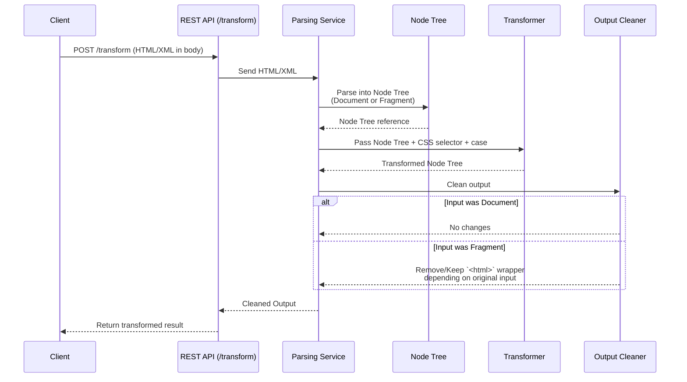

# Uppercase Maker

## About
This application provides a single endpoint to which you can make requests to transform the case of an XML/HTML tree based on a CSS selector. If a CSS selector is passed, all matching tags will have their contents' case transformed. By default if no selector is passed, the contents of all paragraph (`<p></p>`) tags is transformed.

## Usage

TODO: usage args page.

## API

### GET `/`
Retrieve the help page.

### POST `/transform`
Transform the contents of all elements matching a CSS selector to a specified case.

**Headers**:
"content-type": "application/json"

**Body**:
```ts
{
    type RequestBody = {
        transform: "uppercase" | "lowercase",
        html: String,
        selector?: String
    }
}
```

## Application details

### Data flow



- A **POST** request is made against the `/transform` endpoint.
- HTML/XML is ingested by a parsing service through the body of the request.
- The HTML/XML is parsed into either a "Document" or "Fragment" node tree reference based on whether a <!DOCTYPE property has been specified.
- The node tree is then manipulated to transform all the contents of the specified CSS selector to the specified case.
- The output is then cleaned up based on the input to ensure no data is added or lost by the transformation from the previous step
    - As a Document: No changes needed
    - As a Fragment: All items will be wrapped in an `<html></html>` tag by the `Kuchikiki` library. If the input string wasn't wrapped in an `<html></html>` tag to begin with, we  to remove it, otherwise we need to ensure it is not removed.
- Finally the cleaned output is returned to the client via the REST API.

### Technical details

#### Libraries used 

##### Kuchikiki fork
I use a fork of Kuchikiki to parse and manipulate the HTML/XML.

The original library had some exposed functions that I wanted to use such as `parse_fragment` and `parse_html_with_options` whose arguments depend on types from html5ever that were not re-exported. Adding the same version as the transient dependency still gives a type error, so this forced me to fork the repository to use as a dependency instead and re-export the types that I needed.

##### Thiserror
I use the thiserror crate to easily create custom errors based on my requirements.

##### Tokio
I use Tokio as an async runtime to support the Axum framework.

##### Axum
I use the Axum web framework for the API as it is well documented and has a good developer experience.


TODO:
- Get default port number from cmd line args
- Add help page to cmd line args
